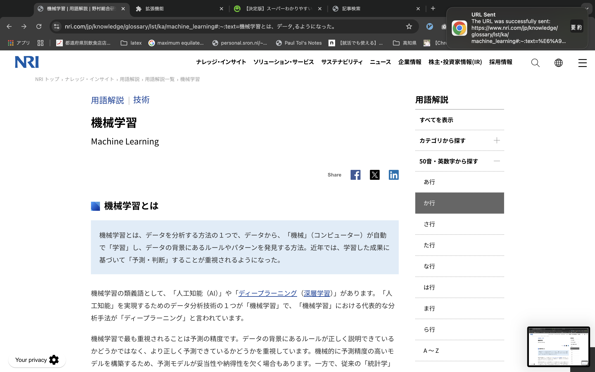
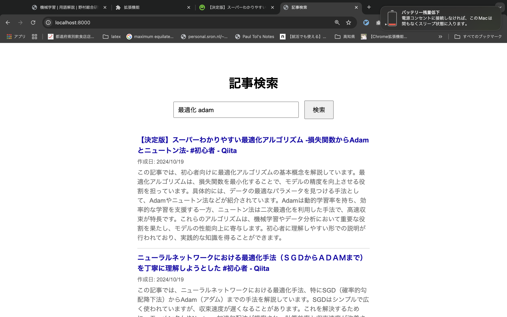

# README

## 概要
localで動作し、chatGPTを利用してウェブサイトをブックマーク、検索するシステムです。

## フォルダ構成
- `/chrome`: データベースファイルを格納するディレクトリ
- `/html`: データベースを検索して、キーワードに関連したサイトを表示するためのウェブアプリです。
- `/server`: chrome、html、chatGPT APIと通信し、ウェブサイト情報を保存するserverです。

## 使用方法
1. 必要な依存関係をインストールします。
2. OPENAI_API_KEYを登録します。
3. chromeフォルダをchromeに拡張機能として登録します。
4. serverに移って``go run main.go``、htmlに移って``python3 -m http.server 8000``で起動します。

## 使用時
1. ``Cmd+Shift+A``でウェブサイトを登録します。通知が来ます。

2. ``Cmd+Shift+D``でウェブサイトを削除します。通知が来ます。

3. ウェブアプリで検索を行えます。

## ライセンス
このプロジェクトはMITライセンスの下で公開されています。
MITライセンスはあまりわかっていませんが、自由に使っていただいてOKです。

## 作者
Tamakoshi Yuji